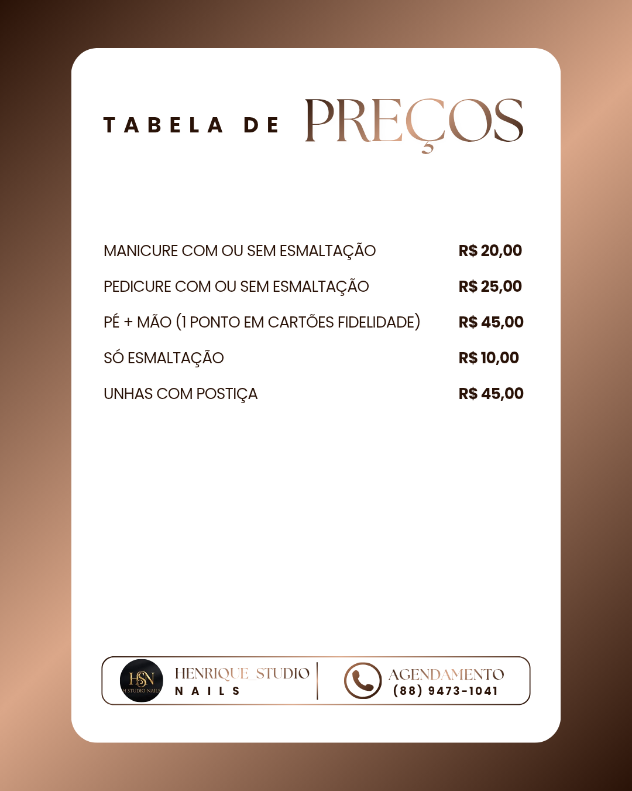
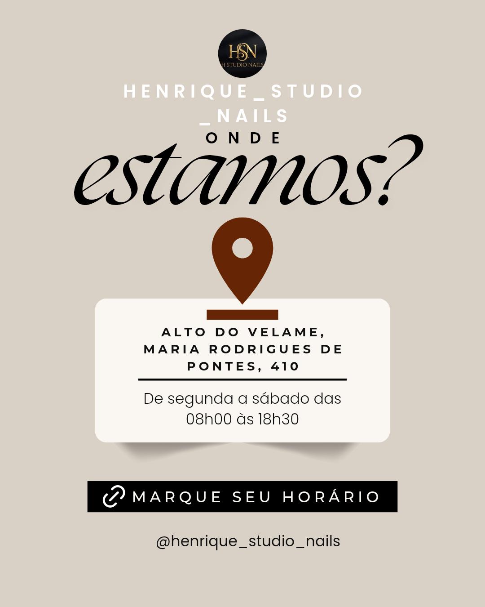

<!DOCTYPE html>        
<html lang="pt-BR">        
<head>        
  <meta charset="UTF-8">        
  <meta name="viewport" content="width=device-width, initial-scale=1.0">        
  <title>Manicure Premium</title>        
        
          
</head>        
        
<body>        
        
<header>        
  <h1>@henrique_studio_nails</h1>        
  <a href="https://instagram.com/henrique_studio_nails" target="_blank" class="insta-link">📸 Instagram</a>        
        
  
        
    Atendimento para homens e mulheres, "cuidado e detalhes que valorizam sua beleza". 
  
        
        
  <button class="btn btn-primary" onclick="agendar()">Agendar Agora</button>        
  <button class="btn btn-secondary" onclick="scrollToSection('galeria')">Ver Trabalhos</button>        
</header>        
        
<section id="galeria">        
  <h2>Valores e Localização</h2>        
        
  
        
    <button class="carousel-btn prev" onclick="mudarSlide('carousel1', -1)">‹</button>  
    <button class="carousel-btn next" onclick="mudarSlide('carousel1', 1)">›</button>  
  
            
        
            
  
        
        
  <h2>Sobre meu atendimento</h2>  
  
  
        
    
        
      Trabalho com atenção aos detalhes, higiene e conforto, proporcionando uma experiência única para cada cliente.        
      Meu objetivo é valorizar sua beleza com cuidado e perfeição.        
    
        

    <section class="blue-fire" onclick="window.open('https://instagram.com/henrique_studio_nails', '_blank')">
  <h2>Veja mais sobre meu trabalho. Transformo detalhes em destaque. 💙</h2>
</section>

  
        
</section>        
        
<section>        
  <h2 class="fire-title">Produtos</h2>        
        
  
        
    
Óleo Reparador de Pontas

Hidratante de Cutícula
      
    
Kit Cuidados das Unhas
        
  
        
</section>        
        
<footer>        
  <a href="https://wa.me/558894731041" target="_blank" class="btn btn-primary btn-whatsapp-footer">  
    Agende seu horário agora pelo WhatsApp  
  </a>  
</footer>        
        
        
        
</body>        
</html>
